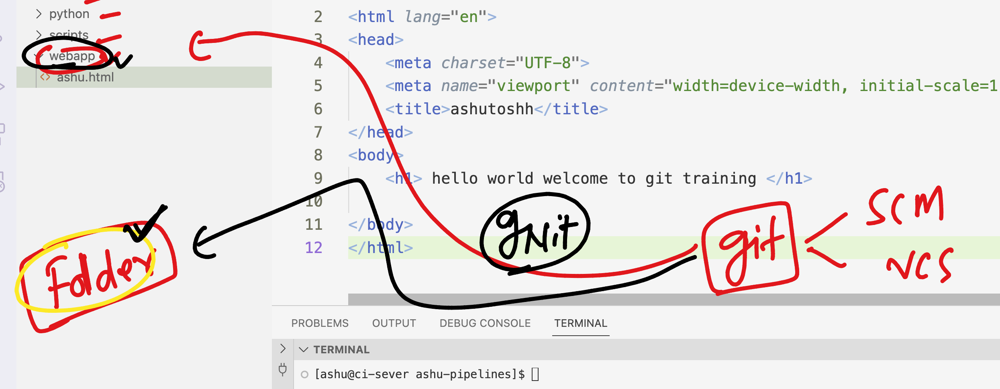
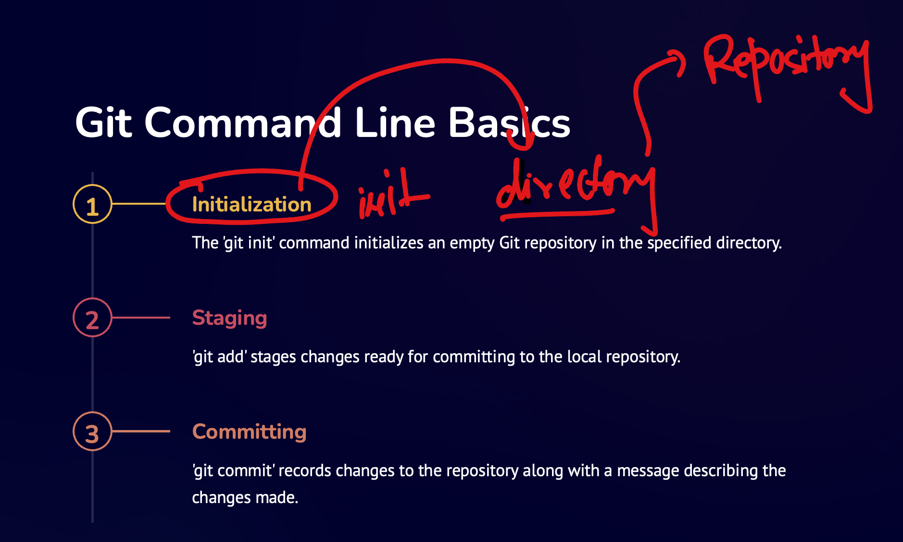
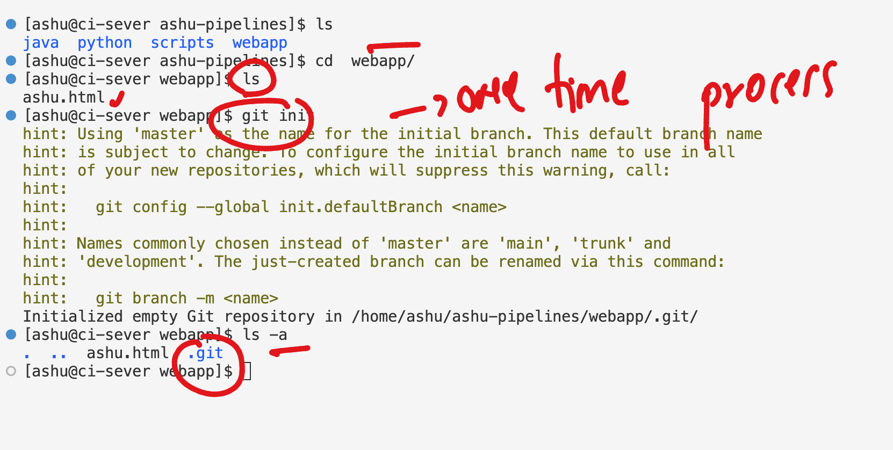
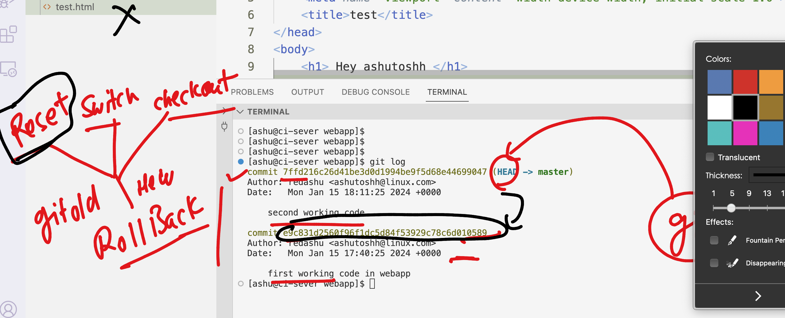

### Using ssh either from windows powershell or using mac terminal -- NO VPN please 

```
 ssh  ashu@18.235.217.86
ashu@18.235.217.86's password: 
   ,     #_
   ~\_  ####_        Amazon Linux 2
  ~~  \_#####\
  ~~     \###|       AL2 End of Life is 2025-06-30.
  ~~       \#/ ___
   ~~       V~' '->
    ~~~         /    A newer version of Amazon Linux is available!
      ~~._.   _/
         _/ _/       Amazon Linux 2023, GA and supported until 2028-03-15.
       _/m/'           https://aws.amazon.com/linux/amazon-linux-2023/

-bash: warning: setlocale: LC_CTYPE: cannot change locale (UTF-8): No such file or directory
[ashu@ci-sever ~]$ 
[ashu@ci-sever ~]$ 
[ashu@ci-sever ~]$ whoami
ashu

```

### RHEL linux 

```
[root@ci-sever ~]# yum   install  git  -y
Failed to set locale, defaulting to C
Loaded plugins: extras_suggestions, langpacks, priorities, update-motd
amzn2-core                                                                                                                            | 3.6 kB  00:00:00     
Resolving Dependencies
--> Running transaction check
---> Package git.x86_64 0:2.40.1-1.amzn2.0.1 will be installed
--> Processing Dependency: git-core = 2.40.1-1.amzn2.0.1 for package: git-2.40.1-1.amzn2.0.1.x86_64
--> Processing Dependency: git-core-doc = 2.40.1-1.amzn2.0.1 for package: git-2.40.1-1.amzn2.0.1.x86_64
--> Processing Dependency: perl-Git = 2.40.1-1.amzn2.0.1 for package: git-2.40.1-1.amzn2.0.1.x86_64
--> Processing Dependency: perl(Git) for package: git-2.40.1-1.amzn2.0.1.x86_64
--> Processing Dependency: perl(Term::ReadKey) for package: git-2.40.1-1.amzn2.0.1.x86_64
--> Running transaction check
---> Package git-core.x86_64 0:2.40.1-1.amzn2.0.1 will be installed
---> Package git-core-doc.noarch 0:2.40.1-1.amzn2.0.1 will be installed
---> Package perl-Git.noarch 0:2.40.1-1.amzn2.0.1 will be installed
--> Processing Dependency: perl(Error) for package: perl-Git-2.40.1-1.amzn2.0.1.noarch
---> Package perl-TermReadKey.x86_64 0:2.30-20.amzn2.0.2 will be installed
--> Running transaction check
---> Package perl-Error.noarch 1:0.17020-2.amzn2 will be installed
--> Finished Dependency Resolution

```

### checking git version 

```
git version 
git version 2.40.1
[ashu@ci-sever ~]$ 

```

### Creating directory structure for future use 

```
[ashu@ci-sever ~]$ whoami
ashu
[ashu@ci-sever ~]$ pwd
/home/ashu
[ashu@ci-sever ~]$ mkdir  ashu-pipelines
[ashu@ci-sever ~]$ ls
ashu-pipelines
[ashu@ci-sever ~]$ mkdir  ashu-pipelines/{webapp,scripts,java,python}
[ashu@ci-sever ~]$ ls
ashu-pipelines
[ashu@ci-sever ~]$ ls ashu-pipelines/
java  python  scripts  webapp
[ashu@ci-sever ~]$ 
```

### converting a normal directory into git repo 



### git init process



### doing git init



### add using git -- start tracking data

```
[ashu@ci-sever webapp]$ ls
ashu.html
[ashu@ci-sever webapp]$ git add ashu.html 
[ashu@ci-sever webapp]$ git status
On branch master

No commits yet

Changes to be committed:
  (use "git rm --cached <file>..." to unstage)
        new file:   ashu.html

```

### in new git version we need to specify some details 

```
[ashu@ci-sever webapp]$ git commit -m  "first working code in webapp"
Author identity unknown

*** Please tell me who you are.

Run

  git config --global user.email "you@example.com"
  git config --global user.name "Your Name"

to set your account's default identity.
Omit --global to set the identity only in this repository.

fatal: unable to auto-detect email address (got 'ashu@ci-sever.(none)')

====>>>

[ashu@ci-sever webapp]$ 
[ashu@ci-sever webapp]$ 
[ashu@ci-sever webapp]$  git config --global user.email ashutoshh@linux.com
[ashu@ci-sever webapp]$ git config --global user.name   redashu
[ashu@ci-sever webapp]$

```

### now we can commit 

```
git commit -m  "first working code in webapp"
[master (root-commit) e9c831d] first working code in webapp
 1 file changed, 12 insertions(+)
 create mode 100644 ashu.html
[ashu@ci-sever webapp]$ 
```

### checking commit history 

```
[ashu@ci-sever webapp]$ git status
On branch master
nothing to commit, working tree clean
[ashu@ci-sever webapp]$ 
[ashu@ci-sever webapp]$ git log
commit e9c831d2560f96f1dc5d84f53929c78c6d010589 (HEAD -> master)
Author: redashu <ashutoshh@linux.com>
Date:   Mon Jan 15 17:40:25 2024 +0000

    first working code in webapp
```

### modified in existing data and untracked file data

```
[ashu@ci-sever webapp]$ git status
On branch master
Changes not staged for commit:
  (use "git add <file>..." to update what will be committed)
  (use "git restore <file>..." to discard changes in working directory)
        modified:   ashu.html

no changes added to commit (use "git add" and/or "git commit -a")

=====>>>

[ashu@ci-sever webapp]$ git status
On branch master
Changes not staged for commit:
  (use "git add <file>..." to update what will be committed)
  (use "git restore <file>..." to discard changes in working directory)
        modified:   ashu.html

Untracked files:
  (use "git add <file>..." to include in what will be committed)
        test.html

```

### >>

```
git add  .
[ashu@ci-sever webapp]$ 
[ashu@ci-sever webapp]$ git status
On branch master
Changes to be committed:
  (use "git restore --staged <file>..." to unstage)
        modified:   ashu.html
        new file:   test.html


[ashu@ci-sever webapp]$ git commit  -m "second working code"
[master 7ffd216] second working code
 2 files changed, 14 insertions(+)
 create mode 100644 test.html
[ashu@ci-sever webapp]$ 
```

### git rollback 



### using checkout 

```
[ashu@ci-sever webapp]$ git log
commit 7ffd216c26d41be3d0d1994be9f5d68e44699047 (HEAD -> master)
Author: redashu <ashutoshh@linux.com>
Date:   Mon Jan 15 18:11:25 2024 +0000

    second working code

commit e9c831d2560f96f1dc5d84f53929c78c6d010589
Author: redashu <ashutoshh@linux.com>
Date:   Mon Jan 15 17:40:25 2024 +0000

    first working code in webapp

====>>>

[ashu@ci-sever webapp]$ git checkout  e9c831d2560f96f1dc5d84f53929c78c6d010589
Note: switching to 'e9c831d2560f96f1dc5d84f53929c78c6d010589'.

You are in 'detached HEAD' state. You can look around, make experimental
changes and commit them, and you can discard any commits you make in this
state without impacting any branches by switching back to a branch.

If you want to create a new branch to retain commits you create, you may
do so (now or later) by using -c with the switch command. Example:

  git switch -c <new-branch-name>

Or undo this operation with:

  git switch -

Turn off this advice by setting config variable advice.detachedHead to false

HEAD is now at e9c831d first working code in webapp
[ashu@ci-sever webapp]$ ls
ashu.html
```


### going forward 

```
[ashu@ci-sever webapp]$ git log
commit e9c831d2560f96f1dc5d84f53929c78c6d010589 (HEAD)
Author: redashu <ashutoshh@linux.com>
Date:   Mon Jan 15 17:40:25 2024 +0000

    first working code in webapp


[ashu@ci-sever webapp]$ 
[ashu@ci-sever webapp]$ 
[ashu@ci-sever webapp]$ git reflog
e9c831d (HEAD) HEAD@{0}: checkout: moving from master to e9c831d2560f96f1dc5d84f53929c78c6d010589
7ffd216 (master) HEAD@{1}: commit: second working code
e9c831d (HEAD) HEAD@{2}: commit (initial): first working code in webapp
[ashu@ci-sever webapp]$

===>>

[ashu@ci-sever webapp]$ git checkout  7ffd216
Previous HEAD position was e9c831d first working code in webapp
HEAD is now at 7ffd216 second working code
[ashu@ci-sever webapp]$ ls
ashu.html  test.html

===>>

[ashu@ci-sever webapp]$ git log
commit 7ffd216c26d41be3d0d1994be9f5d68e44699047 (HEAD, master)
Author: redashu <ashutoshh@linux.com>
Date:   Mon Jan 15 18:11:25 2024 +0000

    second working code

commit e9c831d2560f96f1dc5d84f53929c78c6d010589
Author: redashu <ashutoshh@linux.com>
Date:   Mon Jan 15 17:40:25 2024 +0000

    first working code in webapp
```

### create a repo without init in github then follow command

```
[ashu@ci-sever webapp]$ git remote add origin https://github.com/redashu/hello-ashu-testwal.git
[ashu@ci-sever webapp]$ git push -u origin master
Enumerating objects: 7, done.
Counting objects: 100% (7/7), done.
Delta compression using up to 4 threads
Compressing objects: 100% (6/6), done.
Writing objects: 100% (7/7), 743 bytes | 743.00 KiB/s, done.
Total 7 (delta 2), reused 0 (delta 0), pack-reused 0
remote: Resolving deltas: 100% (2/2), done.
To https://github.com/redashu/hello-ashu-testwal.git
 * [new branch]      master -> master
branch 'master' set up to track 'origin/master'.
[ashu@ci-sever webapp]$ git branch 
* (HEAD detached at 7ffd216)
  master
[ashu@ci-sever webapp]$ 
```
