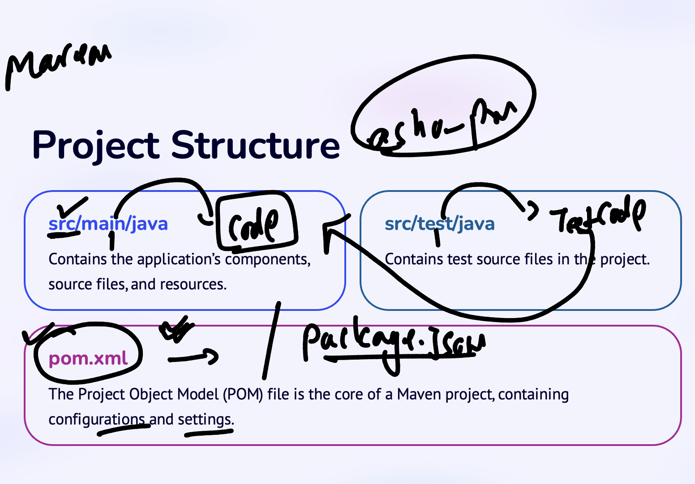
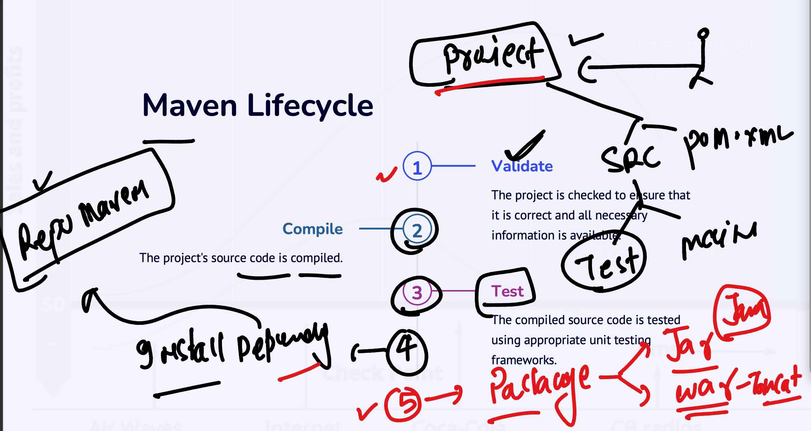
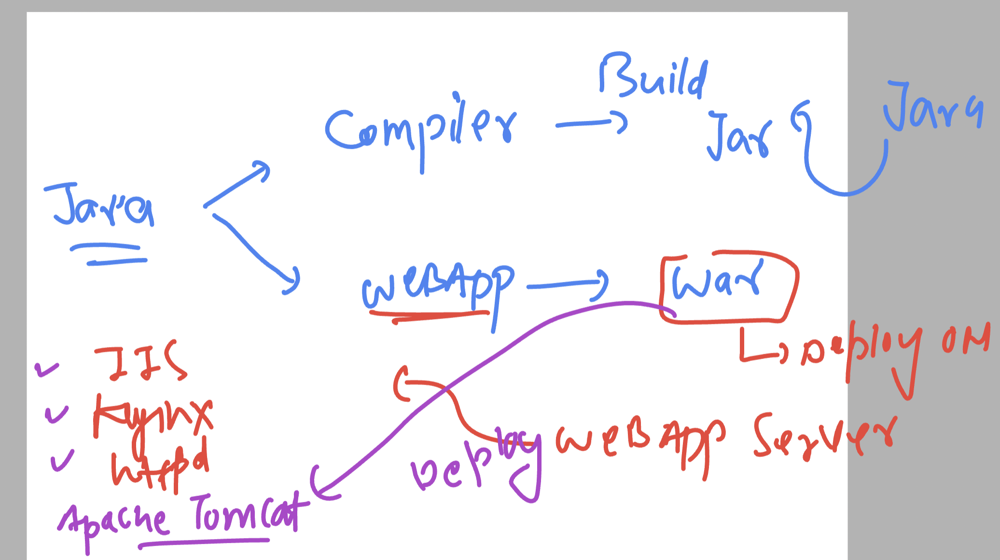

# cicdwalmartb2-15thjan-2024


### github new cloud 


### build automation tool for java -- apache maven 


### Install jdk 11 in linux 

```
yum install java-11* -y
Failed to set locale, defaulting to C
Loaded plugins: extras_suggestions, langpacks, priorities, update-motd
amzn2-core                                                                                                                            | 3.6 kB  00:00:00     
Resolving Dependencies

```

### verify 

```
java --version 
openjdk 11.0.21 2023-10-17 LTS
OpenJDK Runtime Environment Corretto-11.0.21.9.1 (build 11.0.21+9-LTS)
OpenJDK 64-Bit Server VM Corretto-11.0.21.9.1 (build 11.0.21+9-LTS, mixed mode)
[ashu@ci-sever ashu-pipelines]$ 

```

### Download apache maven 

```
[ashu@ci-sever ashu-pipelines]$ cd  ~
[ashu@ci-sever ~]$ ls
ashu-pipelines
[ashu@ci-sever ~]$ wget  https://dlcdn.apache.org/maven/maven-3/3.9.6/binaries/apache-maven-3.9.6-bin.tar.gz
--2024-01-16 16:43:10--  https://dlcdn.apache.org/maven/maven-3/3.9.6/binaries/apache-maven-3.9.6-bin.tar.gz
Resolving dlcdn.apache.org (dlcdn.apache.org)... 151.101.2.132, 2a04:4e42::644
Connecting to dlcdn.apache.org (dlcdn.apache.org)|151.101.2.132|:443... connected.
HTTP request sent, awaiting response... 200 OK
Length: 9410508 (9.0M) [application/x-gzip]
Saving to: ‘apache-maven-3.9.6-bin.tar.gz’

100%[===================================================================================>] 9,410,508   --.-K/s   in 0.07s   

2024-01-16 16:43:10 (136 MB/s) - ‘apache-maven-3.9.6-bin.tar.gz’ saved [9410508/9410508]

[ashu@ci-sever ~]$ ls
apache-maven-3.9.6-bin.tar.gz  ashu-pipelines
```

### extract compressed files

```
[ashu@ci-sever ~]$ ls
apache-maven-3.9.6-bin.tar.gz  ashu-pipelines
[ashu@ci-sever ~]$ 
[ashu@ci-sever ~]$ 
[ashu@ci-sever ~]$ tar  xvzf apache-maven-3.9.6-bin.tar.gz 
apache-maven-3.9.6/README.txt
apache-maven-3.9.6/LICENSE
apache-maven-3.9.6/NOTICE
apache-maven-3.9.6/lib/
```

### verify 

```
[ashu@ci-sever ~]$ ls
apache-maven-3.9.6  apache-maven-3.9.6-bin.tar.gz  ashu-pipelines
[ashu@ci-sever ~]$ 
[ashu@ci-sever ~]$ 
```

### checking internal details

```
[ashu@ci-sever ~]$ ls
apache-maven-3.9.6  apache-maven-3.9.6-bin.tar.gz  ashu-pipelines
[ashu@ci-sever ~]$ ls  apache-maven-3.9.6
bin  boot  conf  lib  LICENSE  NOTICE  README.txt
[ashu@ci-sever ~]$ 
[ashu@ci-sever ~]$ 
[ashu@ci-sever ~]$ 
[ashu@ci-sever ~]$ 
[ashu@ci-sever ~]$ 
[ashu@ci-sever ~]$ 
[ashu@ci-sever ~]$ ls  apache-maven-3.9.6/bin/
m2.conf  mvn  mvn.cmd  mvnDebug  mvnDebug.cmd  mvnyjp
[ashu@ci-sever ~]$ 
[ashu@ci-sever ~]$ 
[ashu@ci-sever ~]$ ls  apache-maven-3.9.6/conf/
logging  settings.xml  toolchains.xml
[ashu@ci-sever ~]$ 
```

### setting env variable for maven 

```
[ashu@ci-sever apache-maven-3.9.6]$ 
[ashu@ci-sever apache-maven-3.9.6]$ export  MAVEN_CONFIG=/home/ashu/apache-maven-3.9.6
[ashu@ci-sever apache-maven-3.9.6]$ 
[ashu@ci-sever apache-maven-3.9.6]$ export PATH=$PATH:$MAVEN_CONFIG/bin
[ashu@ci-sever apache-maven-3.9.6]$ 
[ashu@ci-sever apache-maven-3.9.6]$ export PATH
[ashu@ci-sever apache-maven-3.9.6]$ 
[ashu@ci-sever apache-maven-3.9.6]$ mvn --version 
Apache Maven 3.9.6 (bc0240f3c744dd6b6ec2920b3cd08dcc295161ae)
Maven home: /home/ashu/apache-maven-3.9.6
Java version: 11.0.21, vendor: Amazon.com Inc., runtime: /usr/lib/jvm/java-11-amazon-corretto.x86_64
Default locale: en_US, platform encoding: UTF-8
OS name: "linux", version: "5.10.205-195.804.amzn2.x86_64", arch: "amd64", family: "unix"
```

### making env variable persistent 

```
[ashu@ci-sever apache-maven-3.9.6]$ cat  /home/ashu/.bashrc 
# .bashrc

# Source global definitions
if [ -f /etc/bashrc ]; then
        . /etc/bashrc
fi

# Uncomment the following line if you don't like systemctl's auto-paging feature:
# export SYSTEMD_PAGER=

# User specific aliases and functions
MAVEN_CONFIG=/home/ashu/apache-maven-3.9.6
PATH=$PATH:$MAVEN_CONFIG/bin
export PATH
```

### maven project is having particular structure 



### showing directory structure 

```
[gjupalli@ci-sever gjupall-pipeline]$ ls
java  my-tasks  python  scripts  webapp  webapp2
[gjupalli@ci-sever gjupall-pipeline]$ ls  java/
gj-demo
[gjupalli@ci-sever gjupall-pipeline]$ ls  java/gj-demo/
pom.xml  src
[gjupalli@ci-sever gjupall-pipeline]$ ls  java/gj-demo/src/
main  test
[gjupalli@ci-sever gjupall-pipeline]$ 

```

### Creating directory structure from cli 

```
mvn archetype:generate  -DgroupId=com.example -DartifactId=ashujavaapp -DarchetypeArtifactId=maven-archetype-quickstart -DinteractiveMode=false

===>>>
ashu@ci-sever java]$ ls
ashuappdemo  ashujavaapp
[ashu@ci-sever java]$ ls ashujavaapp/
pom.xml  src
[ashu@ci-sever java]$ ls ashujavaapp/src/
main  test
```

### Understanding few maven life cyle options 



### -- mvn isntall for all the things these days

```
ashuappdemo  ashujavaapp
[ashu@ci-sever java]$ cd  ashuappdemo/
[ashu@ci-sever ashuappdemo]$ ls
pom.xml  src
[ashu@ci-sever ashuappdemo]$ mvn install 
[INFO] Scanning for projects...
[INFO] 
[INFO] ----------------------< com.example:ashuappdemo >-----------------------
[INFO] Building ashuappdemo 1.0-SNAPSHOT
[INFO]   from pom.xml
[INFO] --------------------------------[ jar ]---------------------------------
Downloading from central: https://repo.maven.apache.org/maven2/org/apache/maven/plugins/maven-surefire-plugin/2.22.1/maven-surefire-plugin-2.22.1.pom
Downloaded from central: https://repo.maven.apac


==========>>>
0-SNAPSHOT/ashuappdemo-1.0-SNAPSHOT.pom
[INFO] ------------------------------------------------------------------------
[INFO] BUILD SUCCESS
[INFO] ------------------------------------------------------------------------
[INFO] Total time:  4.117 s
[INFO] Finished at: 2024-01-16T18:10:25Z
[INFO] ------------------------------------------------------------------------
[ashu@ci-sever ashuappdemo]$ ls
pom.xml  src  target
[ashu@ci-sever ashuappdemo]$ ls target/
ashuappdemo-1.0-SNAPSHOT.jar  generated-sources       maven-archiver  surefire-reports
classes                       generated-test-sources  maven-status    test-classes

```

### Now we can run 

```
ashu@ci-sever ashuappdemo]$ ls
pom.xml  src  target
[ashu@ci-sever ashuappdemo]$ ls target/
ashuappdemo-1.0-SNAPSHOT.jar  generated-sources       maven-archiver  surefire-reports
classes                       generated-test-sources  maven-status    test-classes
[ashu@ci-sever ashuappdemo]$ 
[ashu@ci-sever ashuappdemo]$ 
[ashu@ci-sever ashuappdemo]$ java -cp target/ashuappdemo-1.0-SNAPSHOT.jar  com.example.App
Hello World!
[ashu@ci-sever ashuappdemo]$ 

```

### in case of webapp it will create .war file under target directory 

### incase you want to remove build outcome

```
[ashu@ci-sever ashuwebjava]$ mvn clean 
[INFO] Scanning for projects...
[INFO] 
[INFO] ------------------------< com.ashu:ashuwebjava >------------------------
[INFO] Building ashuwebjava Maven Webapp 1.0-SNAPSHOT
[INFO]   from pom.xml
[INFO] --------------------------------[ war ]---------------------------------
Downloading from central: https://repo.maven.apache.org/maven2/org/apache/maven/plugins/maven-clean-plugin/3.1.0/maven-clean-plugin-3.1.0.pom
Downloaded from central: https://repo.maven.apache.org/maven2/org/apache/maven/plugins/maven-clean-plugin/3.1.0/maven-clean-plugin-3.1.0.pom (5.2 kB at 18 kB/s)
[INFO] 
[INFO] --- clean:3.1.0:clean (default-clean) @ ashuwebjava ---
[INFO] Deleting /home/ashu/ashu-pipelines/java/ashuwebjava/target
[INFO] ------------------------------------------------------------------------
[INFO] BUILD SUCCESS
[INFO] ------------------------------------------------------------------------
[INFO] Total time:  0.910 s
[INFO] Finished at: 2024-01-16T18:30:08Z
[INFO] ------------------------------------------------------------------------
[ashu@ci-sever ashuwebjava]$ ls
pom.xml  src
```
### we can deploy war file in apache tomcat 



### update env 

```
TOMCAT_HOME=/home/ashu/apache-tomcat-10.1.18-src
PATH=$PATH:$MAVEN_CONFIG/bin:$TOMCAT_HOME/bin
export PATH
```

### to start tomcat 

```
chmod 755 apache-tomcat-10.1.18-src/bin/ -R

startup.sh

===>>
shutdown.sh
```


