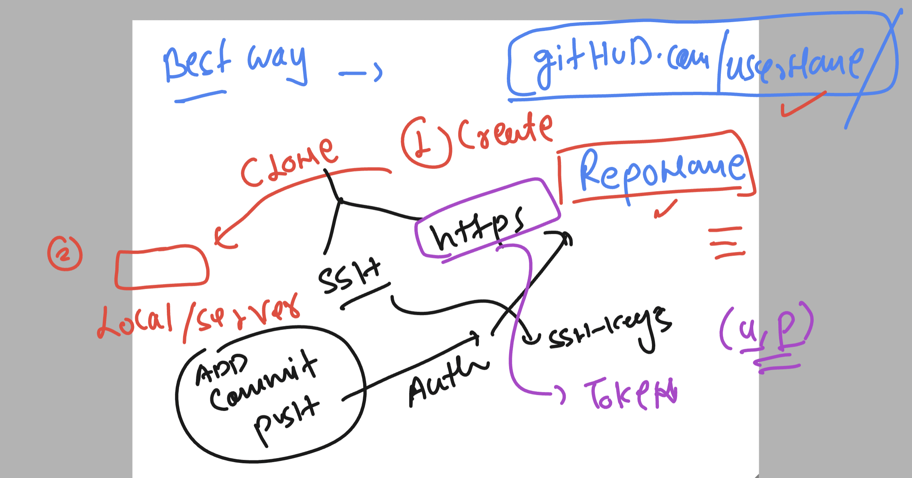
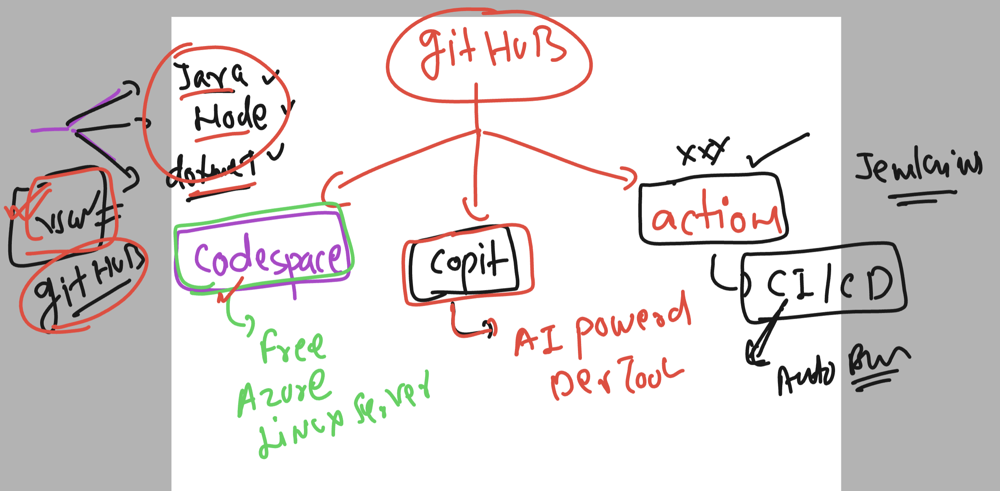
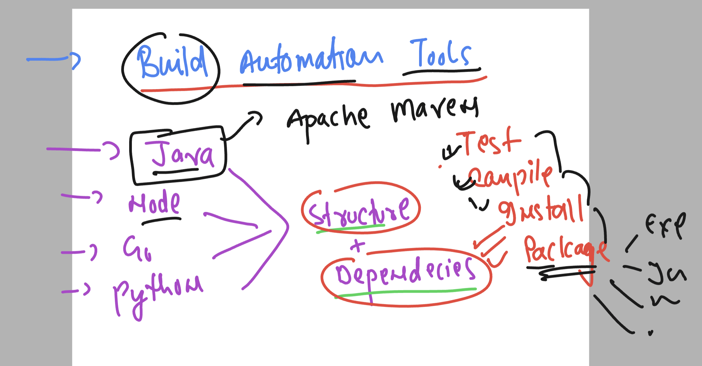

# cicdwalmartb2-15thjan-2024



### github new cloud 



### build automation tool for java -- apache maven 



### Install jdk 11 in linux 

```
yum install java-11* -y
Failed to set locale, defaulting to C
Loaded plugins: extras_suggestions, langpacks, priorities, update-motd
amzn2-core                                                                                                                            | 3.6 kB  00:00:00     
Resolving Dependencies

```

### verify 

```
java --version 
openjdk 11.0.21 2023-10-17 LTS
OpenJDK Runtime Environment Corretto-11.0.21.9.1 (build 11.0.21+9-LTS)
OpenJDK 64-Bit Server VM Corretto-11.0.21.9.1 (build 11.0.21+9-LTS, mixed mode)
[ashu@ci-sever ashu-pipelines]$ 

```

### Download apache maven 

```
[ashu@ci-sever ashu-pipelines]$ cd  ~
[ashu@ci-sever ~]$ ls
ashu-pipelines
[ashu@ci-sever ~]$ wget  https://dlcdn.apache.org/maven/maven-3/3.9.6/binaries/apache-maven-3.9.6-bin.tar.gz
--2024-01-16 16:43:10--  https://dlcdn.apache.org/maven/maven-3/3.9.6/binaries/apache-maven-3.9.6-bin.tar.gz
Resolving dlcdn.apache.org (dlcdn.apache.org)... 151.101.2.132, 2a04:4e42::644
Connecting to dlcdn.apache.org (dlcdn.apache.org)|151.101.2.132|:443... connected.
HTTP request sent, awaiting response... 200 OK
Length: 9410508 (9.0M) [application/x-gzip]
Saving to: ‘apache-maven-3.9.6-bin.tar.gz’

100%[===================================================================================>] 9,410,508   --.-K/s   in 0.07s   

2024-01-16 16:43:10 (136 MB/s) - ‘apache-maven-3.9.6-bin.tar.gz’ saved [9410508/9410508]

[ashu@ci-sever ~]$ ls
apache-maven-3.9.6-bin.tar.gz  ashu-pipelines
```

### extract compressed files

```
[ashu@ci-sever ~]$ ls
apache-maven-3.9.6-bin.tar.gz  ashu-pipelines
[ashu@ci-sever ~]$ 
[ashu@ci-sever ~]$ 
[ashu@ci-sever ~]$ tar  xvzf apache-maven-3.9.6-bin.tar.gz 
apache-maven-3.9.6/README.txt
apache-maven-3.9.6/LICENSE
apache-maven-3.9.6/NOTICE
apache-maven-3.9.6/lib/
```

### verify 

```
[ashu@ci-sever ~]$ ls
apache-maven-3.9.6  apache-maven-3.9.6-bin.tar.gz  ashu-pipelines
[ashu@ci-sever ~]$ 
[ashu@ci-sever ~]$ 
```

### checking internal details

```
[ashu@ci-sever ~]$ ls
apache-maven-3.9.6  apache-maven-3.9.6-bin.tar.gz  ashu-pipelines
[ashu@ci-sever ~]$ ls  apache-maven-3.9.6
bin  boot  conf  lib  LICENSE  NOTICE  README.txt
[ashu@ci-sever ~]$ 
[ashu@ci-sever ~]$ 
[ashu@ci-sever ~]$ 
[ashu@ci-sever ~]$ 
[ashu@ci-sever ~]$ 
[ashu@ci-sever ~]$ 
[ashu@ci-sever ~]$ ls  apache-maven-3.9.6/bin/
m2.conf  mvn  mvn.cmd  mvnDebug  mvnDebug.cmd  mvnyjp
[ashu@ci-sever ~]$ 
[ashu@ci-sever ~]$ 
[ashu@ci-sever ~]$ ls  apache-maven-3.9.6/conf/
logging  settings.xml  toolchains.xml
[ashu@ci-sever ~]$ 
```

### setting env variable for maven 

```
[ashu@ci-sever apache-maven-3.9.6]$ 
[ashu@ci-sever apache-maven-3.9.6]$ export  MAVEN_CONFIG=/home/ashu/apache-maven-3.9.6
[ashu@ci-sever apache-maven-3.9.6]$ 
[ashu@ci-sever apache-maven-3.9.6]$ export PATH=$PATH:$MAVEN_CONFIG/bin
[ashu@ci-sever apache-maven-3.9.6]$ 
[ashu@ci-sever apache-maven-3.9.6]$ export PATH
[ashu@ci-sever apache-maven-3.9.6]$ 
[ashu@ci-sever apache-maven-3.9.6]$ mvn --version 
Apache Maven 3.9.6 (bc0240f3c744dd6b6ec2920b3cd08dcc295161ae)
Maven home: /home/ashu/apache-maven-3.9.6
Java version: 11.0.21, vendor: Amazon.com Inc., runtime: /usr/lib/jvm/java-11-amazon-corretto.x86_64
Default locale: en_US, platform encoding: UTF-8
OS name: "linux", version: "5.10.205-195.804.amzn2.x86_64", arch: "amd64", family: "unix"
```

### making env variable persistent 

```
[ashu@ci-sever apache-maven-3.9.6]$ cat  /home/ashu/.bashrc 
# .bashrc

# Source global definitions
if [ -f /etc/bashrc ]; then
        . /etc/bashrc
fi

# Uncomment the following line if you don't like systemctl's auto-paging feature:
# export SYSTEMD_PAGER=

# User specific aliases and functions
MAVEN_CONFIG=/home/ashu/apache-maven-3.9.6
PATH=$PATH:$MAVEN_CONFIG/bin
export PATH
```


