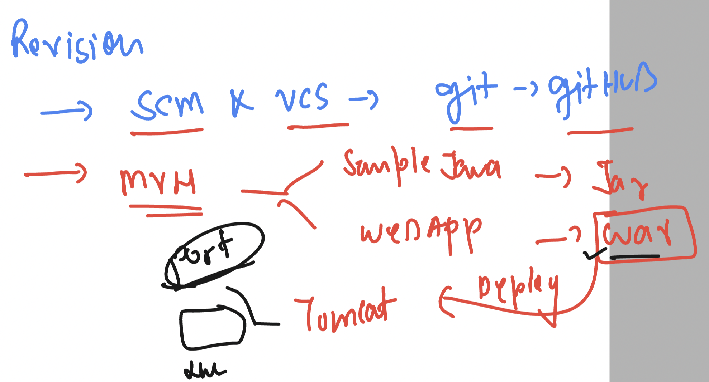
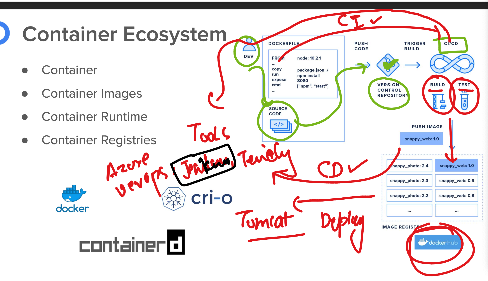

# cicdwalmartb2-15thjan-2024



### build java webapp code and copy it to tomcat 

```
[ashu@ci-sever ashuwebjava]$ ls
pom.xml  src  target
[ashu@ci-sever ashuwebjava]$ cp -v  target/ashuwebjava.war   /home/ashu/apache-tomcat-10.1.18/webapps/
‘target/ashuwebjava.war’ -> ‘/home/ashu/apache-tomcat-10.1.18/webapps/ashuwebjava.war’
[ashu@ci-sever ashuwebjava]$ 


```

### INtroduction to CICD process




