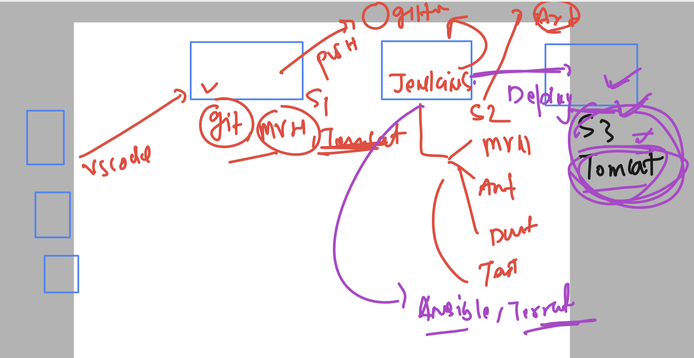

# cicdwalmartb2-15thjan-2024


### build java webapp code and copy it to tomcat 

```
[ashu@ci-sever ashuwebjava]$ ls
pom.xml  src  target
[ashu@ci-sever ashuwebjava]$ cp -v  target/ashuwebjava.war   /home/ashu/apache-tomcat-10.1.18/webapps/
‘target/ashuwebjava.war’ -> ‘/home/ashu/apache-tomcat-10.1.18/webapps/ashuwebjava.war’
[ashu@ci-sever ashuwebjava]$ 


```

### INtroduction to CICD process


### Introduction to jenkins 



### setup 


### Installing jdk 8 or later 

```
[root@jenkins-server ~]# yum install java-11*
Failed to set locale, defaulting to C
Loaded plugins: extras_suggestions, langpacks, priorities, update-motd
Resolving Dependencies
--> Running transaction check
---> Package java-11-amazon-corretto.x86_64 1:11.0.21+9-1.amzn2 will be installed
--> Processing Dependency: libX11 for package: 1:ja
```

### set jenkins software repo 

```
  3  sudo wget -O /etc/yum.repos.d/jenkins.repo     https://pkg.jenkins.io/redhat-stable/jenkins.repo
    4  sudo rpm --import https://pkg.jenkins.io/redhat-stable/jenkins.io-2023.key

```

### Installing jenkins 

```
 yum install jenkins -y
Failed to set locale, defaulting to C
Loaded plugins: extras_suggestions, langpacks, priorities, update-motd
jenkins                                                                                                                               | 2.9 kB  00:00:00     
jenkins/primary_db                                                                                                                    |  48 kB  00:00:00     
Resolving Dependencies
--> Running transaction check
---> Package jenkins.noarch 0:2.426.2-1.1 will be installed
--> Finished Dependency Resolution

Dependencies Resolved

```

### start jenkins server

```
[root@jenkins-server ~]# systemctl enable --now jenkins
Created symlink from /etc/systemd/system/multi-user.target.wants/jenkins.service to /usr/lib/systemd/system/jenkins.service.
[root@jenkins-server ~]# systemctl status jenkins
● jenkins.service - Jenkins Continuous Integration Server
   Loaded: loaded (/usr/lib/systemd/system/jenkins.service; enabled; vendor preset: disabled)
   Active: active (running) since Wed 2024-01-17 17:12:31 UTC; 9s ago
 Main PID: 4969 (java)
   CGroup: /system.slice/jenkins.service
           └─4969 /usr/bin/java -Djava.awt.h
```

### open UI and do post installation 


