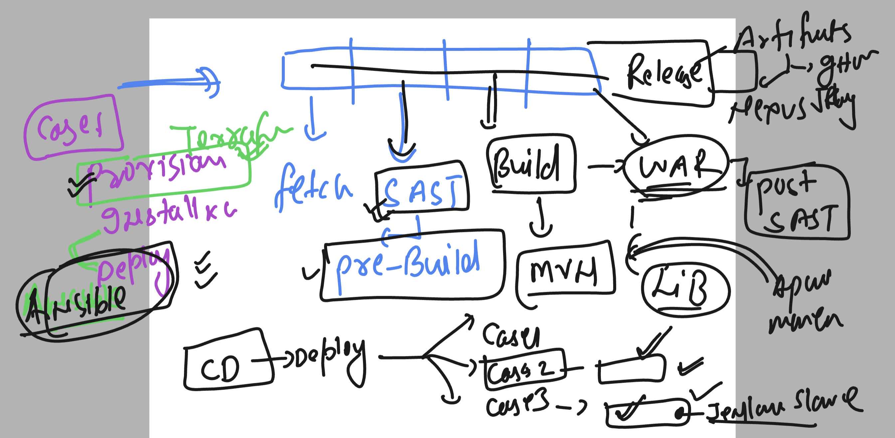
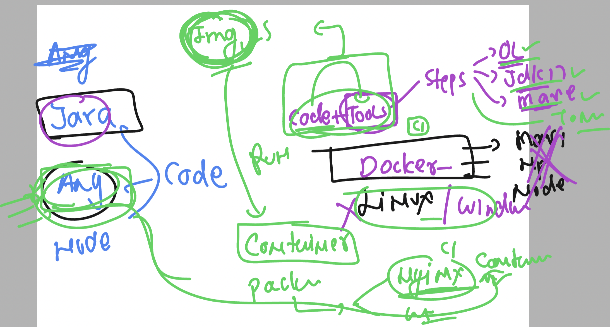
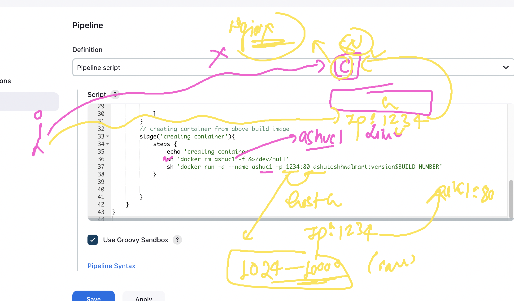
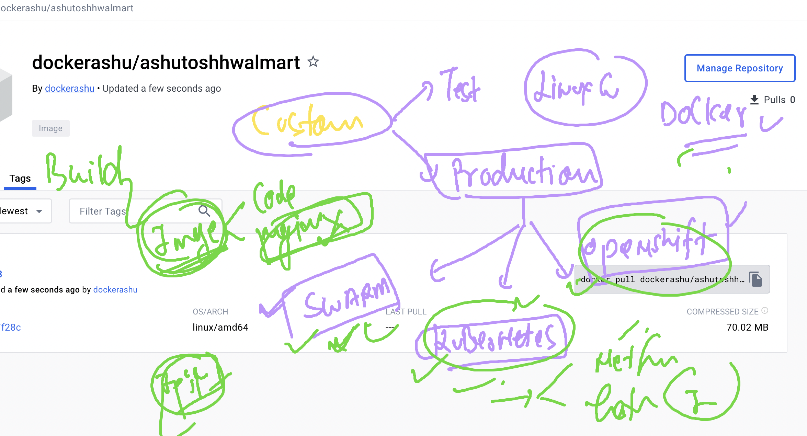

# cicdwalmartb2-15thjan-2024

### Revision 



### a little discussion about docker and container for code 



### Installing docker in jenkins server

```
yum install docker -y
Failed to set locale, defaulting to C
Loaded plugins: extras_suggestions, langpacks, priorities, update-motd
amzn2-core                                                                                                                            | 3.6 kB  00:00:00     
Resolving Dependencies


===>>
usermod -aG docker  jenkins 
[root@jenkins-server ~]# systemctl enable --now docker 
Created symlink from /etc/systemd/system/multi-user.target.wants/docker.service to /usr/lib/systemd/system/docker.service.
[root@jenkins-server ~]# 


===>>
chmod  777 /var/run/docker.sock 
```


### jenkinsfile to build docker image

```
pipeline {
    agent any

    stages {
        stage('testing docker connect') {
            steps {
                echo 'Hello World'
                sh 'docker version'
            }
        }
        // fetching git code 
        stage('taking git code and building it using docker') {
            steps {
                echo 'taking code'
                git branch:'master',url:'https://github.com/redashu/html-sample-app.git'
                sh 'ls'
                /*
                sh 'docker build -t walmashu:version1 . '
                sh 'docker images '
                */
                // using jenkins pipeline method 
                script {
                    def imageName = "ashutoshhwalmart"
                    def imageTag = "version$BUILD_NUMBER"
                    docker.build(imageName + ":" + imageTag, "-f Dockerfile .")
                }
                // verify image
                sh 'docker images '
                
            }
        }
    }
}

```


### docker port forward



### jenkisnfile with docker --- create container 

```
pipeline {
    agent any

    stages {
        stage('testing docker connect') {
            steps {
                echo 'Hello World'
                sh 'docker version'
            }
        }
        // fetching git code 
        stage('taking git code and building it using docker') {
            steps {
                echo 'taking code'
                git branch:'master',url:'https://github.com/redashu/html-sample-app.git'
                sh 'ls'
                /*
                sh 'docker build -t walmashu:version1 . '
                sh 'docker images '
                */
                // using jenkins pipeline method 
                script {
                    def imageName = "ashutoshhwalmart"
                    def imageTag = "version$BUILD_NUMBER"
                    docker.build(imageName + ":" + imageTag, "-f Dockerfile .")
                }
                // verify image
                sh 'docker images '
                
            }
        }
        // creating container from above build image 
        stage('creating container'){
            steps {
                echo 'creating container'
                sh 'docker rm ashuc1 -f &>/dev/null'
                sh 'docker run -d --name ashuc1 -p 1234:80 ashutoshhwalmart:version$BUILD_NUMBER'
            }
        
            
        }
    }
}

```

### pushing image jenkinsfile changes

```
pipeline {
    agent any

    stages {
        stage('testing docker connect') {
            steps {
                echo 'Hello World'
                sh 'docker version'
            }
        }
        // fetching git code 
        stage('taking git code and building it using docker') {
            steps {
                echo 'taking code'
                git branch:'master',url:'https://github.com/redashu/html-sample-app.git'
                sh 'ls'
                /*
                sh 'docker build -t walmashu:version1 . '
                sh 'docker images '
                */
                // using jenkins pipeline method 
                script {
                    def imageName = "dockerashu/ashutoshhwalmart"
                    def imageTag = "version$BUILD_NUMBER"
                    docker.build(imageName + ":" + imageTag, "-f Dockerfile .")
                }
                // verify image
                sh 'docker images '
                
            }
        }
        // creating container from above build image 
        stage('creating container'){
            steps {
                echo 'creating container'
                sh 'docker rm ashuc1 -f &>/dev/null'
                sh 'docker run -d --name ashuc1 -p 1234:80 dockerashu/ashutoshhwalmart:version$BUILD_NUMBER'
            }
        
            
        }
        // pushing image to docker hub 
        stage('pushing image to docker hub'){
            steps {
                echo 'pushing image'
                script {
                    def imageName = "dockerashu/ashutoshhwalmart"
                    def imageTag = "version$BUILD_NUMBER"
                    def ashuCred = "3a475b3c-c8f7-4237-b396-4d3172fe1e88"
                    docker.withRegistry('https://registry.hub.docker.com',ashuCred){
                        docker.image(imageName + ":" + imageTag).push()
                    }
                }
            }
        }
    }
}

```


### image deploy options 



